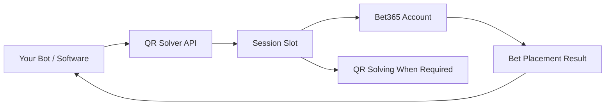

# 🔥🤖 QR Solver — Bet365 Bet Placement API

> **Server-side bet placement for bet365 through a simple, scalable API.**  
> Place bets from your own software without maintaining fragile browser-based automation.

---

## 🚀 What Is This?

**QR Solver Bet Placement API** is an infrastructure service designed for developers, betting bot operators, and automated betting platforms that need to place bets on **bet365** from a backend or non-browser environment.

Instead of relying on unstable browser automation, you can send the bet details to our backend through a documented API, and our system handles the placement flow for your authorized bet365 sessions.

The service also supports environments where **QR code verification** is required, using our existing QR solving infrastructure as part of the placement process.

---

## ✨ Key Features

- 🔥 **Bet365 bet placement via API**
- 🤖 **Built for bots, trading tools, and automation platforms**
- ⚡ **Low-latency backend execution**
- 🧩 **Simple integration with your existing software**
- 📲 **QR code solving included where required**
- 🧠 **No need to maintain costly browser-based workflows**
- 📈 **Scalable by session slots**
- 🛠️ **Documented API with Swagger**

---

## 🧠 Why Use It?

Many automated betting setups depend on browser sessions, UI selectors, extensions, or headless browsers. These solutions are often expensive to maintain, difficult to scale, and prone to session instability.

Our API-based approach allows your software to interact with a dedicated backend service built specifically for bet placement workflows.

You send the required bet information, and our system processes the placement using the active session slot assigned to the account.

---

## ⚙️ How It Works

1. **Your software sends the bet details** to the QR Solver API.
2. **Our backend processes the request** using one of your active session slots.
3. **QR code verification is handled** when required in supported countries.
4. **The bet placement result is returned** to your system.
5. **Scale up** by adding more session slots for more simultaneous accounts.

---

## 📚 API Documentation

Full API documentation is available here:

👉 **[https://qrsolver.com/docs/api/swagger-ui/](https://qrsolver.com/docs/api/swagger-ui/)**

The Swagger documentation includes the available endpoints, request formats, and response structures required to integrate the service into your own bot or platform.

---

## 💳 Pricing

We charge by **session slot**.

A session slot represents one bet365 account running at the same time.

| Usage | Required Slots |
|---|---:|
| 1 account running simultaneously | 1 slot |
| 10 accounts running simultaneously | 10 slots |
| 50 accounts running simultaneously | 50 slots |
| 100+ accounts running simultaneously | Bulk pricing available |

### Standard Price

**80 USDT / month per session slot**

### Bulk Orders

We offer discounted pricing for orders over **100 session slots**.

For pricing, availability, and conditions, contact us on Telegram:

👉 **[@qrsolver](https://t.me/qrsolver)**

### 📣 Info Channel

Official announcements, service updates, and important information:

👉 **[@infoqrsolver](https://t.me/infoqrsolver)**

### 💬 Support & Sales

Pricing, onboarding, technical questions, and contract requests:

👉 **[@qrsolver](https://t.me/qrsolver)**

---

## 👨‍💻 Who Is This For?

This service is suitable for:

- Betting bot developers
- Automated betting platforms
- Trading and alert-based betting tools
- Teams managing multiple authorized bet365 sessions
- Developers looking for a non-browser bet placement workflow

---

## ✅ Benefits

- Save development and maintenance time
- Avoid complex browser automation infrastructure
- Integrate with only a few API requests
- Run multiple accounts by purchasing multiple session slots
- Use QR solving and bet placement in a single workflow
- Scale your operation with predictable monthly pricing

---

## 🛡️ Responsible Use

This service is intended only for users operating accounts they own or are explicitly authorized to manage.

Clients are responsible for ensuring that their use of the service complies with all applicable laws, regulations, platform rules, and local gambling requirements.

QR Solver does not guarantee profits, betting outcomes, account status, or sportsbook decisions.

---

## 🤝 Get Started

Ready to integrate bet365 bet placement into your bot?

1. Join the info channel: **[@infoqrsolver](https://t.me/infoqrsolver)**
2. Contact support and sales: **[@qrsolver](https://t.me/qrsolver)**
3. Choose the number of session slots you need
4. Connect your software using the API documentation
5. Start placing bets through the backend workflow

---

## 🔥 QR Solver

**Bet365 bet placement. QR solving. Backend automation. One API.** 

PD: We offer too a desktop app for manual betting. Ask us!

👉 **Info:** [@infoqrsolver](https://t.me/infoqrsolver)  
👉 **Support & Sales:** [@qrsolver](https://t.me/qrsolver)  
👉 **API Docs:** [qrsolver.com/docs/api/swagger-ui](https://qrsolver.com/docs/api/swagger-ui/)
.
